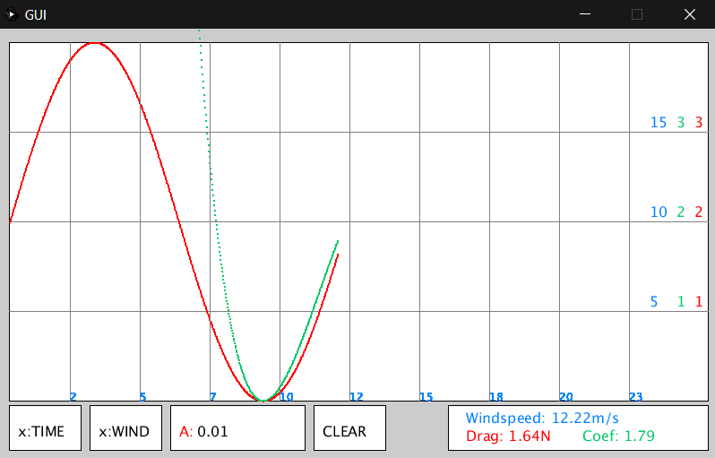

# Wind Tunnel

#### Password:

password for raspbery pi is `W1nd`

### Description:

Wind tunnel software for SPCC

Uses a raspberry pi running processing communicating with an Arduino [over USB serial].

The raspberry pi handles GUI and control; calculating the coefficient of friction and plotting data [to screen and recording to file]

The Arduino sets the windspeed based on received value from raspberry pi (m/s); the Arduino sends back force sensor data (Newtons).

Arduino used for testing is a Nano.

The user can set the surface area with keyboard; (just type, backspace reset to zero.)

# Files Rundown:

## GUI/GUI.pde

The processing GUI application

## GUI/windData.csv

The recorded data from the last run of program, 

## BASH/autoCopy.sh

Copies windData.csv to a flashdrive.

Currently will just error if there is no flashdrive.

## arduino/arduino.ino

The arduino software that recieves the desired wind speed, and reports back the actual windspeed and drag force.

# Calibration of force sensor

The force sensor reads an analogue value on `A0`0->1023

It is connected to 3V3, GND and A0

## Rough calibration

**Note; this extremely rough; just for testing IDE guessed the weight of my phone was 200g.**

**NEED TO TO PROPER CALIBRATION; i.e. look up sensor details**

No Load: Reads 60

'2N' of load: Read **370**

***assuming linear sensor readout***

`FORCE = READOUT*0.0055 - 0.33`

## Number input
Users will need to input the surface area of the car in order to get drag coefficient:
On screen keyboard? / External Keyboard
https://pimylifeup.com/raspberry-pi-on-screen-keyboard/
