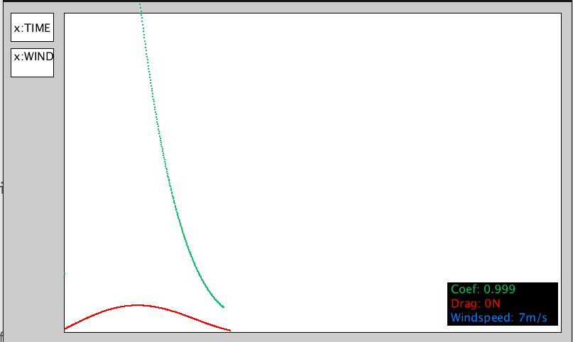

# Wind Tunnel

Wind tunnel software for SPCC

Uses a raspberry pi running processing communicating with an Arduino [over USB serial].

The raspberry pi handles GUI and control; calculating the coefficient of friction and plotting data [to screen and recording to file]

The Arduino sets the windspeed based on received value from raspberry pi (m/s); the Arduino sends back force sensor data (Newtons).

Arduino used for testing is a Nano.

# To do [15/6/2021]

- Fix UI [as detailed below]
- test
- add ability to enter frontal surface area of car into program; to calculate drag coef.
- delete file/create a new file for each run.
- create Arduino interface functions
  - i.e. actually make them interface with Arduino.

# Calibration of force sensor

The force sensor reads an analogue value on `A0`0->1023

It is connected to 5V, GND and A0

## Rough calibration

**Note; this extremely rough; just for testing IDE guessed the weight of my phone was 200g.**

**NEED TO TO PROPER CALIBRATION; i.e. look up sensor details**

No Load: Reads 60

'2N' of load: Read **370**

***assuming linear sensor readout***

`FORCE = READOUT*0.0055 - 0.33`

# GUI LAYOUT

Currently gui is a bit of a mess;

The x-axis (i.e line y=0) is different for drag force,windspeed and coefficient *Need to fix*

Want UI to look more like:

with x and y axis ticks.

Also the pictures are of ***x:wind***; the program will also plot **y:** windspeed,drag force, drag coef **x:** time *in **x:Time*** mode.

## Number input
Users will need to input the surface area of the car innorder to get drag coefficient:
On screen keyboard?
https://pimylifeup.com/raspberry-pi-on-screen-keyboard/
